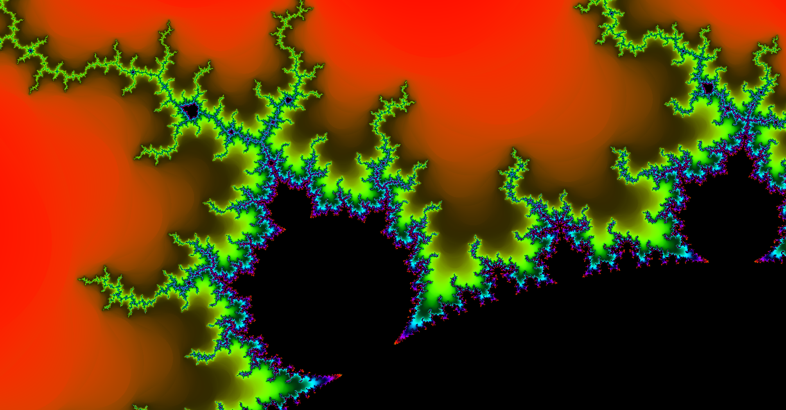

# Mandelbrot
Weekend project that renders the Mandelbrot and Multibrot set using Jolt

## Installation 
1. Clone repo with `git clone --recursive https://github.com/junnys6018/Mandelbrot`
2. Premake files are provided to generate project files for any supported toolset.  
  2.1 For example to generate visual studio project files, download premake at `https://github.com/premake/premake-core/releases` 
  and run `premake5.exe vs2019` in the root directory
3. Binarys are generated in `bin/` directory
4. After compiling the binary, move it to the root directoy of the repo and run it there, otherwise the program won't be able to find the shader file and it will crash

## Pictures
 
 
 
